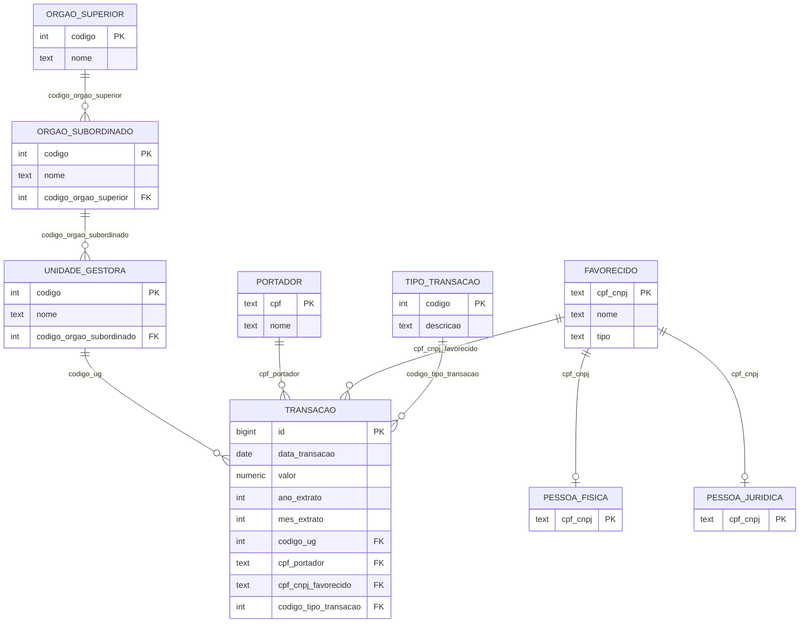

# Etapa 2 — Modelo Relacional + Normalização

## 2.1 Mapeamento ER → Relacional

Regras aplicadas:
- **R1.** Cada entidade vira uma relação. PK do modelo conceitual vira PK da relação.
- **R2.** Relacionamentos 1:N — a chave do lado "1" é replicada como FK no lado "N".
- **R3.** Especialização disjunta total em `FAVORECIDO`: optamos pela estratégia **superclasse + subclasses** (3 tabelas) para refletir fielmente o EER. Discriminador `tipo` permanece na superclasse.
- **R4.** Atributos compostos não há — todos atômicos. Multivalorados não há.

## 2.2 Esquema relacional (lista de relações)

Notação: <ins>chave primária</ins>, *chave estrangeira*.

```
ORGAO_SUPERIOR (codigo, nome)
    PK: codigo

ORGAO_SUBORDINADO (codigo, nome, codigo_orgao_superior)
    PK: codigo
    FK: codigo_orgao_superior → ORGAO_SUPERIOR(codigo)

UNIDADE_GESTORA (codigo, nome, codigo_orgao_subordinado)
    PK: codigo
    FK: codigo_orgao_subordinado → ORGAO_SUBORDINADO(codigo)

PORTADOR (cpf, nome)
    PK: cpf
    -- cpf armazenado como TEXT por causa da máscara anonimizada do Portal

FAVORECIDO (cpf_cnpj, nome, tipo)
    PK: cpf_cnpj
    CHECK: tipo IN ('PF', 'PJ', 'NI')   -- NI = Não Informado / sigiloso

PESSOA_FISICA (cpf_cnpj)
    PK: cpf_cnpj
    FK: cpf_cnpj → FAVORECIDO(cpf_cnpj)

PESSOA_JURIDICA (cpf_cnpj)
    PK: cpf_cnpj
    FK: cpf_cnpj → FAVORECIDO(cpf_cnpj)

TIPO_TRANSACAO (codigo, descricao)
    PK: codigo

TRANSACAO (id, data_transacao, valor, ano_extrato, mes_extrato,
           codigo_ug, cpf_portador, cpf_cnpj_favorecido, codigo_tipo_transacao)
    PK: id   (BIGSERIAL — surrogate)
    FK: codigo_ug              → UNIDADE_GESTORA(codigo)
    FK: cpf_portador           → PORTADOR(cpf)
    FK: cpf_cnpj_favorecido    → FAVORECIDO(cpf_cnpj)
    FK: codigo_tipo_transacao  → TIPO_TRANSACAO(codigo)
    CHECK: ano_extrato BETWEEN 2003 AND EXTRACT(YEAR FROM CURRENT_DATE)
    CHECK: mes_extrato BETWEEN 1 AND 12
    CHECK: valor <> 0
```

Total: **9 relações** (7 entidades + 2 subclasses).

## 2.3 Dependências funcionais (DFs)

Para cada relação, listamos as DFs não triviais e mostramos que a chave determina todos os demais atributos (BCNF/3FN).

| Relação | DFs principais | Forma normal atingida |
|---|---|---|
| ORGAO_SUPERIOR | `codigo → nome` | BCNF |
| ORGAO_SUBORDINADO | `codigo → nome, codigo_orgao_superior` | BCNF |
| UNIDADE_GESTORA | `codigo → nome, codigo_orgao_subordinado` | BCNF |
| PORTADOR | `cpf → nome` | BCNF |
| FAVORECIDO | `cpf_cnpj → nome, tipo` | BCNF |
| PESSOA_FISICA | (apenas a PK; sem outros atributos) | BCNF |
| PESSOA_JURIDICA | (apenas a PK; sem outros atributos) | BCNF |
| TIPO_TRANSACAO | `codigo → descricao` | BCNF |
| TRANSACAO | `id → data_transacao, valor, ano_extrato, mes_extrato, codigo_ug, cpf_portador, cpf_cnpj_favorecido, codigo_tipo_transacao` | BCNF |

**Argumento BCNF (e portanto 3FN):** em todas as relações o único determinante de qualquer DF não trivial é a PK — não há atributo não-chave determinando outro atributo não-chave, nem chaves candidatas alternativas com sobreposição.

## 2.4 Justificativa de normalização

**Partimos do "schema plano" do CSV original** (uma única tabela com 15 colunas, todas as informações por transação). Esse formato:

- **1FN**: já está em 1FN (todos os valores atômicos, sem repetições internas).
- **2FN**: a tabela plana não tem chave composta com dependências parciais — então tecnicamente está em 2FN. Mas o problema crítico está adiante.
- **3FN — VIOLAÇÃO:** existe a DF transitiva `cpf_portador → nome_portador`, `codigo_orgao_superior → nome_orgao_superior`, `codigo_ug → nome_ug`, etc. Ou seja, vários atributos não-chave determinam outros atributos não-chave. Isso gera:
  - **Anomalia de atualização**: corrigir o nome de um órgão obriga atualizar milhões de linhas.
  - **Anomalia de inserção**: não dá pra cadastrar uma UG nova sem ter uma transação associada.
  - **Anomalia de exclusão**: apagar a última transação de um portador apaga o portador.
  - **Redundância maciça**: o nome "MINISTÉRIO DA SAÚDE" aparece centenas de milhares de vezes.

**Decomposição feita** (Etapa 1 → 2): extraímos as DFs transitivas em tabelas próprias (ORGAO_SUPERIOR, ORGAO_SUBORDINADO, UNIDADE_GESTORA, PORTADOR, FAVORECIDO, TIPO_TRANSACAO). Cada uma agora tem PK simples determinando os demais atributos. Verificação de **preservação**: o `JOIN` natural dessas tabelas com TRANSACAO reconstrói exatamente o CSV original (preservação de dados e dependências confirmadas).

**Resultado:** todas as 9 relações estão em **3FN (e BCNF)**. Concluímos pelo menos 3FN como exigido pelo enunciado.

## 2.5 Decisões de desnormalização (e por que NÃO fizemos)

Considerou-se manter `nome_orgao_superior` redundante em UNIDADE_GESTORA para evitar dois JOINs em consultas frequentes. **Rejeitado** porque:
1. O ganho de performance é marginal num dataset de poucos milhões de linhas em PostgreSQL com índices.
2. A consistência (cidadania de dados, LAI) é prioritária — nome errado em uma fonte governamental é grave.
3. O custo de atualização (rename de ministério) ficaria muito alto.

Mantivemos `ano_extrato` e `mes_extrato` em TRANSACAO mesmo havendo `data_transacao` — **não é desnormalização** porque o extrato e a data podem divergir (transação de fim de mês entra na próxima fatura). São informações semanticamente distintas, não redundantes.

## 2.6 Diagrama do esquema relacional (Mermaid)



---

## Entregável da Etapa 2 — Checklist
- [x] Esquema relacional completo (9 relações, todas com PK/FK explícitas)
- [x] Mapeamento ER → Relacional documentado com regras aplicadas
- [x] Dependências funcionais listadas por relação
- [x] Justificativa de normalização até 3FN/BCNF com argumento formal
- [x] Discussão de desnormalização (considerada e justificadamente rejeitada)
